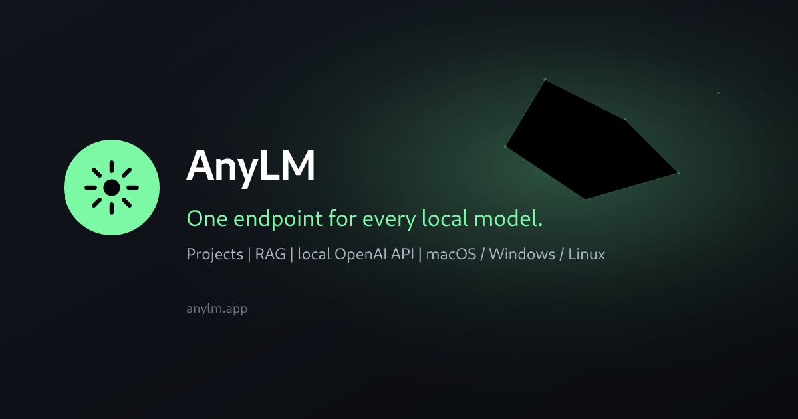

# AnyLM

**Local-first LLM workspace for [Ollama](https://ollama.com).**  
Projects with RAG, streaming multi-agent chat, and one OpenAI-compatible endpoint every local app can share — inference stays on your machine.

[Download](https://anylm.app/download) · [Website](https://anylm.app) · [Releases](https://anylm.app/releases) · [Launch kit](docs/launch/README.md)



## Why AnyLM

Most local tooling either gives you a runtime (Ollama) or a chat window. AnyLM adds the missing workspace layer:

- **Projects** with instructions and attached reference docs  
- **RAG** — docs are chunked, embedded, and retrieved into chat  
- **Multi-agent** orchestration with a visible agent trail  
- **One local API** (`http://127.0.0.1:3227/v1`) so Cursor, Continue, and scripts share a resident runtime  
- **Desktop installers** for macOS, Windows, and Linux  

Works with the models you already pulled. No cloud inference required.

## Download

| Platform | Get it |
| --- | --- |
| macOS (Apple Silicon / Intel) | [anylm.app/download](https://anylm.app/download) |
| Windows | [anylm.app/download](https://anylm.app/download) |
| Linux (AppImage) | [anylm.app/download](https://anylm.app/download) |

Or grab assets from [GitHub Releases](https://github.com/workvar/AnyLM/releases). Prerequisites: [Ollama](https://ollama.com) running locally, with a chat model and (for RAG) `nomic-embed-text`.

```bash
ollama pull llama3.2
ollama pull nomic-embed-text
```

## Repository layout

| Path | Role |
| --- | --- |
| [`app/`](app/) | Electron desktop app (TypeScript, Bun) |
| [`web/`](web/) | Marketing + download site (Next.js) — reads GitHub Releases |
| [`firebase/`](firebase/) | Auth, Firestore rules, hosted sign-in page |
| [`docs/`](docs/) | Release notes, specs, [launch kit](docs/launch/README.md) |
| [`press-kit/`](press-kit/) | Logos and social images for Product Hunt / press |
| `auth-backend/` | Retired NestJS service (reference only — not shipped) |

There is no inference server of yours to operate. Governance logic runs inside the app against Firestore under the signed-in user’s token; `firebase/firestore.rules` is the authorization layer.

## Develop from source

Prerequisites: [Bun](https://bun.sh) 1.1+, Ollama as above.

```bash
./scripts/setup.sh
./scripts/dev.sh
```

Firebase emulators:

```bash
./scripts/dev.sh --emulator
```

Manual app setup is in [`app/README.md`](app/README.md); Firebase deploy notes in [`firebase/README.md`](firebase/README.md).

The OpenAI-compatible endpoint runs inside the app on `http://127.0.0.1:3227/v1`.

## Configuration and secrets

| File | Contents | Ships in the app? |
| --- | --- | --- |
| `app/.env` | Firebase project id, web API key, public OAuth client ids, local service hosts | **Yes** — treat as public |
| `.env.example` (repo root) | Code-signing + GitHub release credentials | No — CI only |

Provider client secrets for Google/GitHub live in the Firebase project. Outlook uses a public client with PKCE. User tokens are stored via the OS keystore (`app/src/main/token-store.ts`).

`app/scripts/build-env.js` refuses to bake keys matching `SECRET` / `PASSWORD` / `PRIVATE` / `*_TOKEN` / `CSC_*` / `APPLE_*` into the bundle.

## What enforcement does and does not guarantee

Firestore rules stop a user raising their own token limit, editing org policy without the role for it, reading a colleague’s prompts, or rewriting usage history. They cannot compel a client to report usage, so limits are cooperative rather than adversarial-proof.

That trade is deliberate: anyone who can patch the app can also run Ollama directly. REST-shaped paths in `app/src/main/api/` keep a seam if a server must return later.

## Launch & community

Shipping on Product Hunt, HN, and community channels? Start here:

- [Launch kit](docs/launch/README.md) — PH fields, social drafts, checklist  
- [Messaging](docs/launch/messaging.md) — taglines and FAQ  
- [Brand / press kit](docs/brand/README.md)  
- [Contributing](CONTRIBUTING.md) · [Security](SECURITY.md) · [License (MIT)](LICENSE)

## License

[MIT](LICENSE) © 2026 Yash Aryan and contributors.
